# 📊 Diagramas de Flujo - Sistema de Carritos y Pedidos

**Fecha:** 9 de febrero de 2026  
**Objetivo:** Visualización gráfica del sistema completo

---

## 🗺️ Diagrama 1: Flujo Principal del Usuario

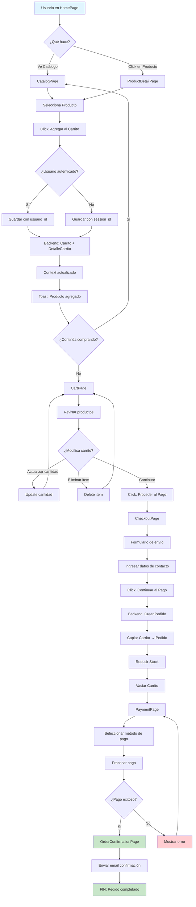

---

## 🗄️ Diagrama 2: Modelo de Datos (ER)

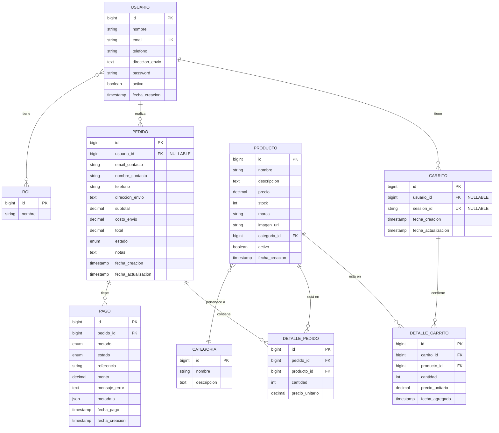

---

## 🔄 Diagrama 3: Proceso de Conversión (Carrito → Pedido)

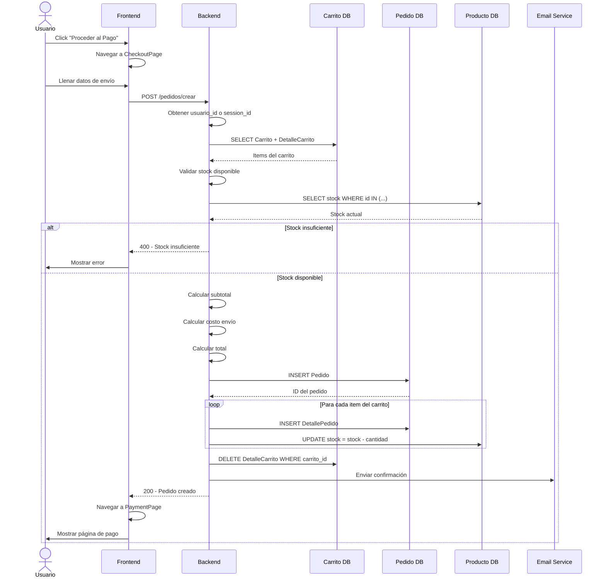

---

## 🔐 Diagrama 4: Gestión de Sesiones (Usuario Anónimo vs Registrado)

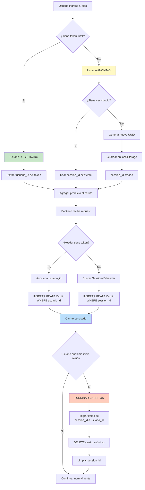

---

## 💳 Diagrama 5: Proceso de Pago

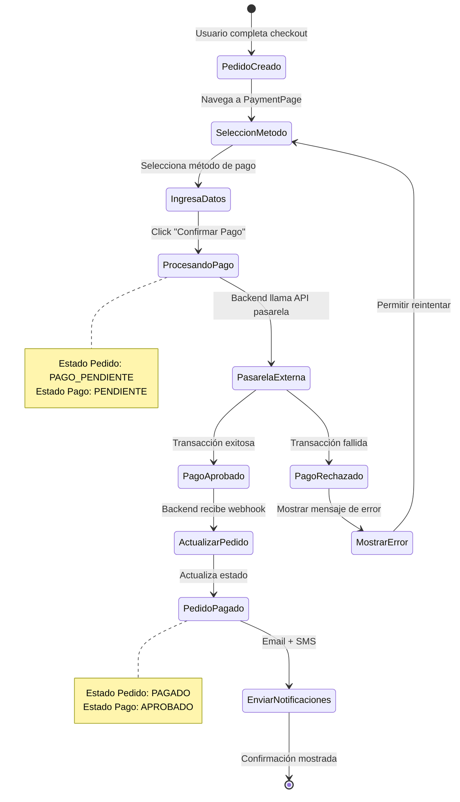

---

## 📦 Diagrama 6: Estados del Pedido (Ciclo de Vida)

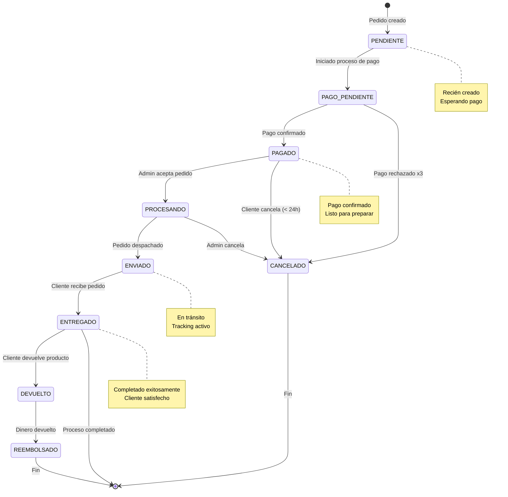

---

## 🏗️ Diagrama 7: Arquitectura de Capas

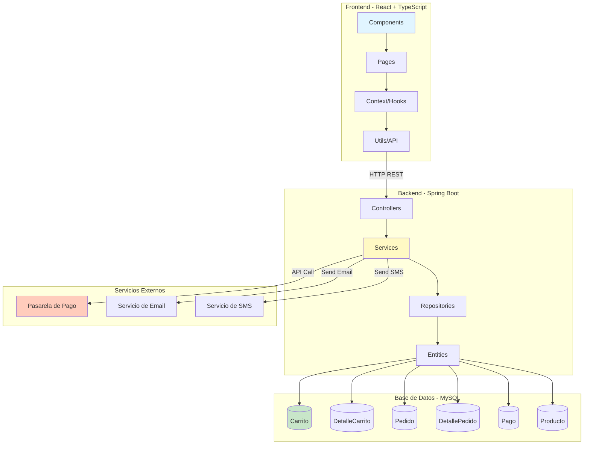

---

## 🔄 Diagrama 8: API Endpoints del Carrito

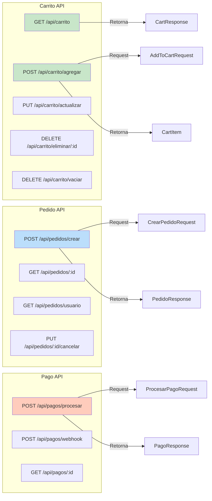

---

## 🧪 Diagrama 9: Flujo de Testing

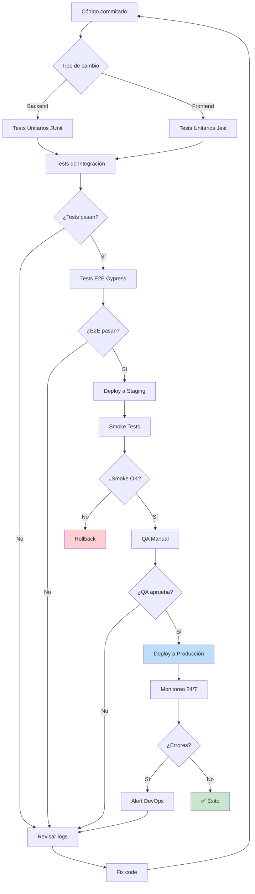

---

## 📊 Diagrama 10: Monitoreo y Analytics

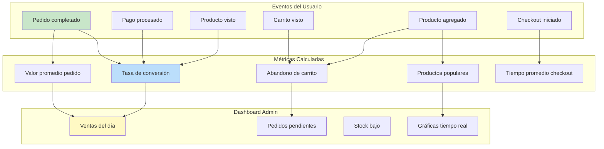

---

## 🔍 Diagrama 11: Validaciones en el Sistema

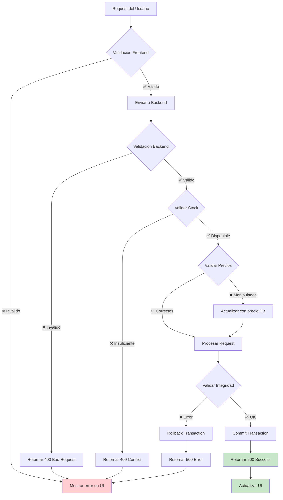

---

## 📱 Diagrama 12: Responsive Flow (Mobile vs Desktop)

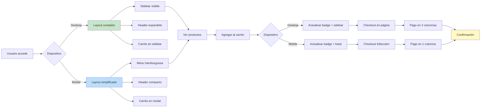

---

## 🎯 Uso de los Diagramas

### Para Desarrolladores:

- **Diagrama 1**: Entender el flujo completo del usuario
- **Diagrama 2**: Referencia rápida del modelo de datos
- **Diagrama 3**: Implementar el proceso de conversión
- **Diagrama 4**: Manejar sesiones correctamente
- **Diagrama 7**: Arquitectura general del sistema

### Para Product Managers:

- **Diagrama 1**: Visualizar experiencia del usuario
- **Diagrama 6**: Estados del pedido
- **Diagrama 10**: Métricas y analytics

### Para QA:

- **Diagrama 9**: Flujo de testing
- **Diagrama 11**: Validaciones a probar
- **Diagrama 12**: Casos responsive

---

## 📝 Notas Finales

Estos diagramas son **documentación viva** y deben actualizarse cuando:

- Se agregan nuevas funcionalidades
- Cambia el flujo de algún proceso
- Se modifican estados o validaciones
- Se integran nuevos servicios externos

---

**Última actualización:** 9 de febrero de 2026  
**Versión:** 1.0  
**Herramienta:** Mermaid.js
